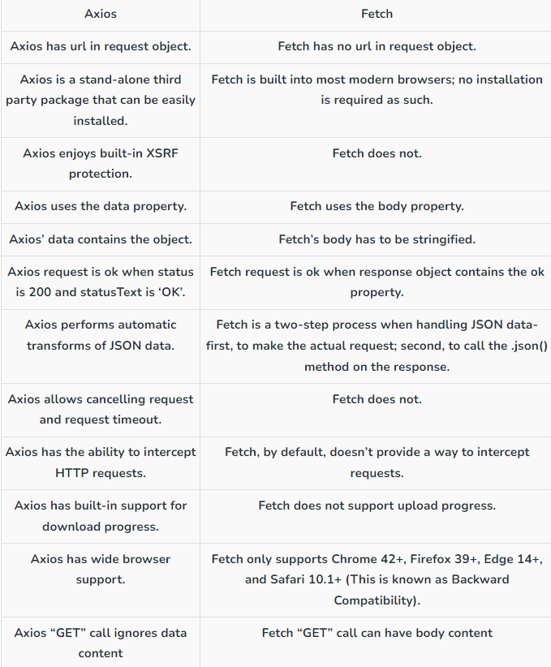

# ToyReactFE

index.html -> root -> main.jsx -> app.jsx

https://github.com/CASIA-IVA-Lab/FastSAM

## fastapi BP

https://github.com/zhanymkanov/fastapi-best-practices
## frontend set up
npm create vite@<version>

npm install react-bootstrap bootstrap
npm install react-router-dom

cd <proj-dir>
npm install
npm run dev

## Some React/JS sampler - Airbnb
https://github.com/airbnb/javascript/tree/master/react
## fastapi BP

https://github.com/zhanymkanov/fastapi-best-practices

## Axios vs Fetch

## Github Actions

https://www.edwardthomson.com/blog/github_actions_advent_calendar.html
